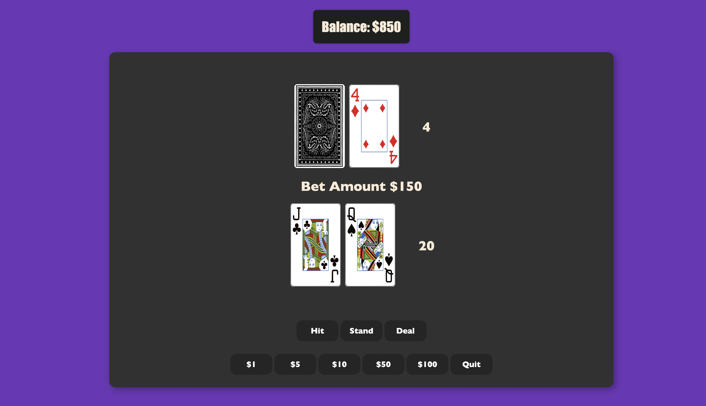

# Project Title: Blackjack Game

## Description:

This project is a  browser-based Blackjack game. It's designed for users to play the popular casino game of Blackjack directly in their web browser. The game is created using HTML for structuring, CSS for styling, and JavaScript OOP for logic and interactivity.

## Gameplay:

1. **Start Screen**: When the user first opens the game, they are greeted with a start screen and a button asking if they'd like to play Blackjack.
2. **Balance Input**: After clicking the start button, the user is directed to enter their starting balance. This amount is used to place bets throughout the game.
3. **Game Screen**: After setting the balance, the user is taken to the main game screen. Here, they can see their balance, bet amount, and the cards of both the player and the dealer. There are several buttons for game control:
    - *Deal Button*: Deals the cards to start a round.
    - *Hit Button*: The player draws another card.
    - *Stand Button*: The player ends their turn, and the dealer plays.
    - *Bet Buttons*: The player can bet in increments of $1, $5, $10, $50, or $100.
    - *Quit Button*: The user can quit the game at any time, and the page will reload.
4. **Game Logic**: The game follows standard Blackjack rules. The player and dealer aim to get as close to 21 as possible without going over. The player goes first, choosing to hit (draw another card) or stand (end their turn). If the player gets more than 21, they bust and lose their bet. If not, it's the dealer's turn. The dealer must hit until they have at least 17. If the dealer goes over 21, the player wins. If both the player and dealer stand, the one with the score closest to 21 wins. Ties are possible.

## How to Run:

1. 
2. Start playing!

